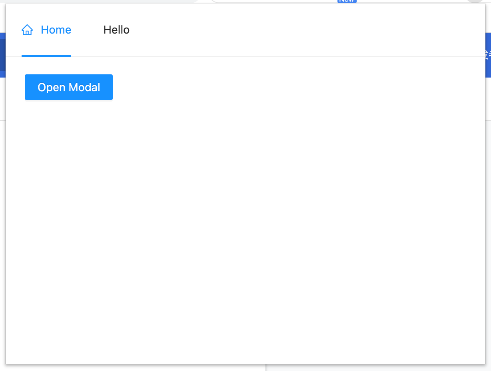

# React-TS-Chrome-Ext

Use React + TypeScript + Antd + Wasm to develop Chrome Extension.

## Build Wasm

```shell
curl https://rustwasm.github.io/wasm-pack/installer/init.sh -sSf | sh
cargo install cargo-generate
npm install npm@latest -g
cargo generate --git https://github.com/rustwasm/wasm-pack-template
# This should prompt you for the new project's name. We will use "wasm".
cd wasm
wasm-pack build --out-dir ../src/wasm
```

## Build Package

- install

```sh
yarn install
```

- build

```sh
yarn build
```

The output directory is `./build/`.

## Popup Preview


